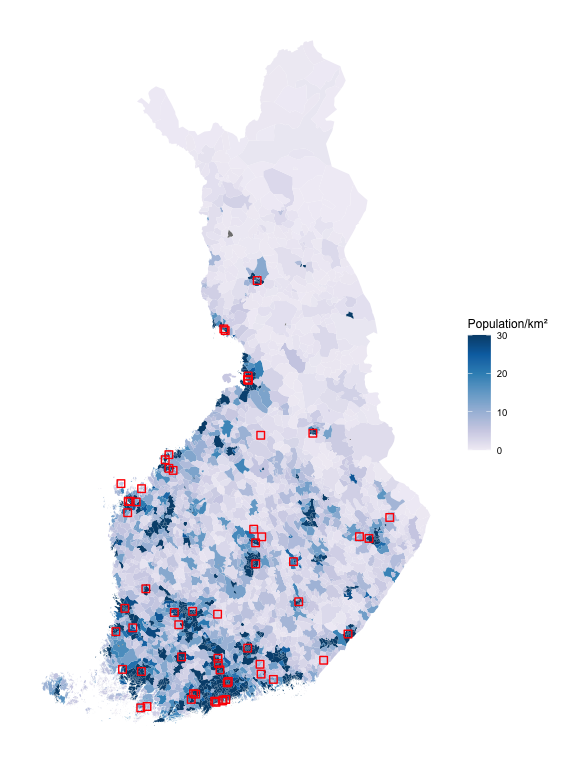
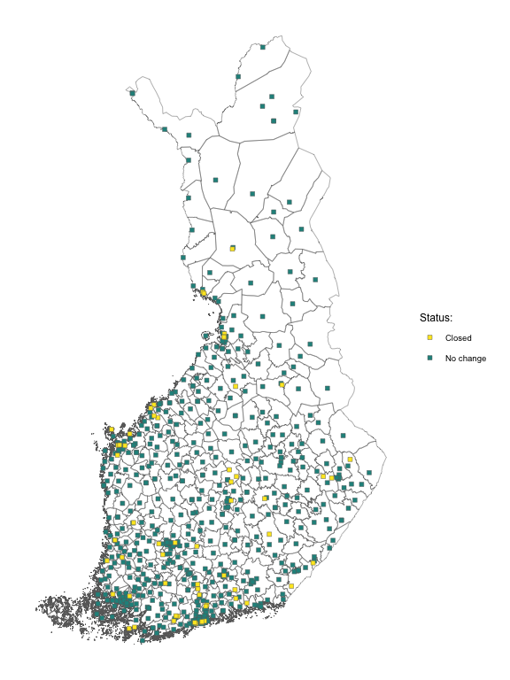
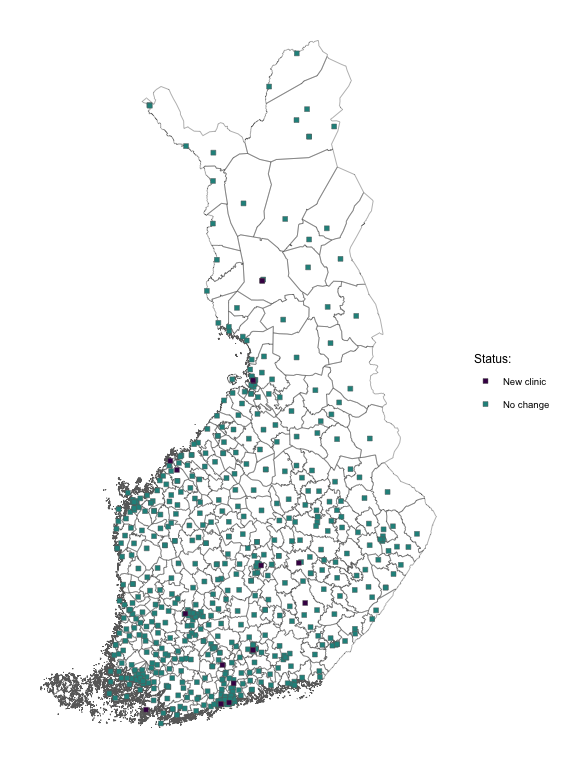

# The Effects of Primary Care Clinic Closures: How Older People’s
Geographical Distance to Care Affects Their Health and Service Use?
xx

# The effects of primary care clinic closures: How older people’s geographical distance to care affects their health and service use?

## Setup

``` r
# Load 'here' package for relative file paths
  library(here)

# Run setup script
  source(here::here("scripts", "setup.R"), echo = FALSE)
```

## Identifying closed stations

Running data to identify health station closures and new station entries

``` r
# Run script
  source(here::here("scripts", "identifying_closed_stations.R"), echo = FALSE)
```

    Passing 77 addresses to the Nominatim single address geocoder

    Query completed in: 77.4 seconds

    Warning in CPL_crs_from_input(x): GDAL Message 1: +init=epsg:XXXX syntax is
    deprecated. It might return a CRS with a non-EPSG compliant axis order.

    Requesting response from: http://geo.stat.fi/geoserver/wfs?service=WFS&version=1.0.0&request=getFeature&typename=tilastointialueet%3Akunta1000k_2013

    Warning: Coercing CRS to epsg:3067 (ETRS89 / TM35FIN)

    Data is licensed under: Attribution 4.0 International (CC BY 4.0)

    Requesting response from: http://geo.stat.fi/geoserver/wfs?service=WFS&version=1.0.0&request=getFeature&typename=postialue%3Apno_2019

    Warning: Coercing CRS to epsg:3067 (ETRS89 / TM35FIN)

    Data is licensed under: Attribution 4.0 International (CC BY 4.0)

    Passing 661 addresses to the Nominatim single address geocoder

    Query completed in: 875.7 seconds

    Passing 5 addresses to the Nominatim single address geocoder

    Query completed in: 5 seconds

## Maps

Drawing map of closed clinics with population density:

``` r
# Running script to draw the maps
  source(here::here("scripts", "map_closures.R"), echo = FALSE)
```



Drawing map with all stations: all closed stations marked with yellow
squares. All new clinics marked with purple squares.

``` r
# Running script to draw the maps
  source(here::here("scripts", "map_all_coordinates.R"), echo = FALSE)
```





## Municipality level descriptive statistics

Descriptive statistics using Sotkanet data here.
