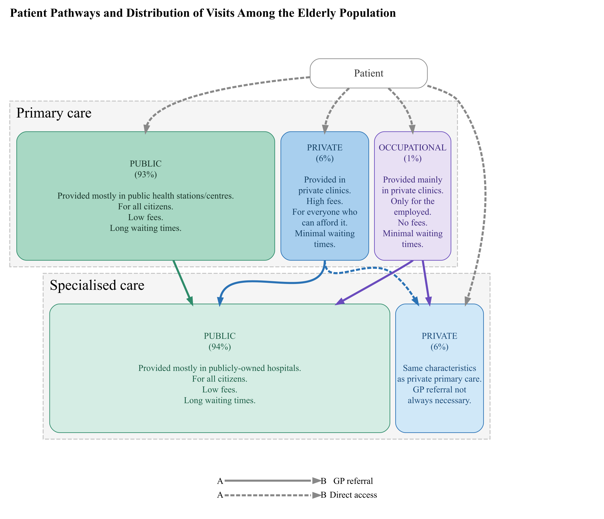

# The Effects of Primary Care Clinic Closures: How Older People’s
Geographical Distance to Care Affects Their Health and Service Use?
Tuukka Holster, Mika Kortelainen, Marja-Lisa Laukkonen, Konsta Lavaste,
Kaisa Palo, Markku Satokangas, Tiina Hetemaa & Vuokko Heikinheimo

# The effects of primary care clinic closures: How older people’s geographical distance to care affects their health and service use?

## Setup

``` r
# Load 'here' package for relative file paths
  library(here)

# Run setup script
  source(here::here("scripts", "setup.R"), echo = FALSE)
```

## Identifying closed stations

Running data to identify health station closures and new station
entries. The data is collected from public sources using Internet
Archive WayBack Machine (DOI will be added).

Quatro documentation shows identified closures as a list with station
name, municipality, and closure year. Closure year is defined as t if
the station was in the data at t-1 but not in t.

``` r
# Run script
  source(here::here("scripts", "identifying_closed_stations.R"), echo = FALSE)

# Toimiim vain html -formaatilla -> GitHub Pages jotta saa näkymään muunkin kuin lähdekoodin repossa
# DT::datatable(exits_short)
```

## Maps

This section runs the codes that draw maps of health stations in
Finland. The three maps include stations that i) closed ii) opened and
iii) all stations are saved as pdf/png files to output-folder. An
interactive map is then printed for the Quatro document.

*Drawing a map of closed clinics with population density:*

Closed health stations are marked with red squares. Population density
is calculated by dividing the population of the postal code area by the
area of the postal code region (km2). To improve map readability,
population density values are truncated at 100 people per square
kilometre—all areas exceeding this threshold are capped at 100,
regardless of their actual density.

``` r
# Running script to draw the maps
  source(here::here("scripts", "map_closures.R"), echo = FALSE)
  
  exits_graph
```


*Drawing map of stations closed and opened during the study period
relative to other stations that did not close:*

All closed stations are marked with yellow squares, new clinics marked
with purple squares, and others that remain (mostly) in the same
location are marked with green squares.

``` r
# Running script to draw the maps
  source(here::here("scripts", "map_all_stations.R"), echo = FALSE)
  
  all_clinics_graph
```


``` r
  new_stations_graph
```


The pfd/png images of the maps are saved in output-folder.

*Drawing interactive map for the GitHub documentation: TBA*

``` r
##| context: server # add if using shiny option
#| echo: true
#| message: false
#| warning: false

# Running script to draw and print the interactive map
# source(here::here("scripts", "map_testi.R"), local = TRUE)

#output$closure_map <- ggiraph::renderGirafe({
#  make_interactive_map(show_fill = isTRUE(input$show_fill))
#})
  
source(here::here("scripts", "interactive_map.R"), echo = FALSE)

# print(interactive_plot)
```

## Municipality level descriptive statistics

Descriptive statistics at municipality level. Treatment (\>1 closure in
municipality) and control (no closures) group mean, standard deviation,
and relative difference.

Source: THL (<https://sotkanet.fi/sotkanet/fi/index>)

``` r
# Running script to make table
  source(here::here("scripts", "mun_level_summary_table.R"), echo = FALSE)
```


    ==================================================================================================
    variable.ena                 mean.treat   sd.treat   mean.control sd.control  relative.diff  smd  
    --------------------------------------------------------------------------------------------------
    Health stations (N)            5.073      [4.508]       1.518       [1.248]      +234.2     +1.087
    Population (ppl)             61942.510  [106074.660]  10904.970   [20778.730]    +468.0     +0.676
    Population density (ppl/km2   184.366    [478.606]      40.410     [151.839]     +356.2     +0.410
    Morbidity index               116.127     [18.562]     126.626     [26.174]       -8.3      -0.465
    Aged > 64 (%)                  19.888     [4.054]       24.314      [5.568]       -18.2     -0.914
    Tax revenue (€/capita)        3595.732   [476.429]     3185.438    [531.652]      +12.9     +0.818
    Demographic dependency ratio   59.354     [7.858]       67.849      [7.907]       -12.5     -1.085
    Unemployment rate (%)          10.829     [3.742]       10.809      [3.848]       +0.2      +0.005
    At-risk-of-poverty rate (%)    12.807     [3.701]       14.443      [4.041]       -11.3     -0.425
    Net migration                  -0.880     [5.223]       -4.446      [8.219]       -80.2     +0.520
    Municipalities                   41                      267                                      
    --------------------------------------------------------------------------------------------------

## Finnish healthcare system chart: patient pathways

The system chart visualizing the patient pathways, structure and
distribution of visits among the elderly population. Primary care is
provided independently by nurses, GPs, and specialists. Specialised care
is typically provided by specialists assisted by nurses. Shares of the
service use of different subsystems among people aged over 64 years are
from THL Sampo -datacubes
([Sampo](https://sampo.thl.fi/pivot/prod/fi/hilmokokonaisuus/kuutio01/fact_hilmokok_kuutio01?row=palvelu-49937&row=palvelusektori-918725&column=ikaluokka-109987&filter=measure-87578&filter=aika-660839)).


    Attaching package: 'magrittr'

    The following object is masked from 'package:ggmap':

        inset

    The following object is masked from 'package:purrr':

        set_names

    The following object is masked from 'package:tidyr':

        extract

    Linking to librsvg 2.61.0


